# Mobile Robotics Assignment GoTo

## Installation
Place the contents of this repo inside $MR_DIR/ws02/src/mr_goto  
`git clone git@github.com:VincentKen/MR-GoTo.git $MR_DIR/ws02/src/mr_goto`

replace ekf_node.cpp and ekf_node.hpp with the ones in MR_EKF
also in your ekf.cpp add `reset_ = Reset::INTI_POSE;` to set_init_pose
`void EKF::set_init_pose(const Pose2D &p)
{
    if (!init_pose_)
        init_pose_ = make_shared<Pose2D>(p);
    else
        *init_pose_ = p;
    reset_ = Reset::INTI_POSE;
}`

same for pf
replace particle_filter_node.cpp and particle_filter_node.hpp with the ones in MR_PF
also in your particle.cpp add `reset_ = Reset::INTI_POSE;` to set_init_pose
`void ParticleFilter::set_init_pose(const Pose2D &p)
{
    if (!init_pose_)
        init_pose_ = make_shared<Pose2D>(p);
    else
        *init_pose_ = p;
    reset_ = Reset::INTI_POSE;
}`

tuw::Pose2DPtr ParticleFilter::compute_estimated_pose()
{
    if (!samples_.empty()){
        std::sort(samples_.begin(), samples_.end(), Sample<Pose2D>::greater);
        estimated_pose_ = samples_.at(0);
    }
    return estimated_pose_;
}

## Build
Build using `colcon build`

## Run
Run using `ros2 run mr_goto mr_goto`

### Run with map
We can also choose the map file we want `mr_goto` to run with.
```bash
ros2 run mr_goto mr_goto --ros-args -p map_file:=<path_to_map>
```
or with the launch file:
```bash
ros2 launch mr_goto launch.py map:=<name_of_map>
```
For example:
```bash
ros2 launch mr_goto launch.py map:=cave
```
Note: Per default, we are using the `line` map.

## Launch
You first need to execute
```bash
make build-ws02
```
in the project's root directory.

Launch using
```bash
ros2 launch mr_goto launch.py
```

### Launch with map
You can also specify the map you want to use by using an additional `map` argument.
```bash
ros2 launch mr_goto launch.py map:=<map_name>
```
For example:
```bash
ros2 launch mr_goto launch.py map:=cave
```
Note: Per default, we are using the `line` map.

### Optional ekf or pf
For launching the `ekf` or `pf` node, execute
```bash
ros2 launch mr_goto launch.py localization:=<node>
```
For example:
```bash
ros2 launch mr_goto launch.py localization:=ekf
```

### Launch with parameter file
Optionally, you can start the launch file with a parameter file by executing:
```bash
ros2 launch mr_goto launch.py params_file:=ws02/src/mr_goto/config/params.yaml
```
The `params.yml` file is a relative path to your YAML configuration file.
A sample params file would look like this:
```yml
goto:
  ros__parameters:
    map: cave
    localization: pf
```
Note: As described in the previous sections, the parameters have their default values set to `map:=line` and `localization:=ekf`.
# Documentation
## Members
- Thomas Khlebovitch (01427030)
- Benjamin Gallauner
- Julius Salamon
- Vincent Kenbeek (12229949)

## Tasked Completed
- Thomas Khlebovitch
    - Create launch files (80 points)

- Benjamin Gallauner

- Julius Salamon

- Vincent Kenbeek
    - Create a new node (50 points)
    - Plan waypoints to target pose and publish them (50 points)

### Create a new node
As can be seen from the image below. We created a new node in ROS. In the beginning this node only had a simple timer callback but was later extended to incorporate the other completed tasks as well.  
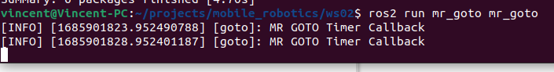

### Self localization using own implementation
We implemented our self localization using our own method. The screenshot below shows our node printing the x coordinate of the robot.  
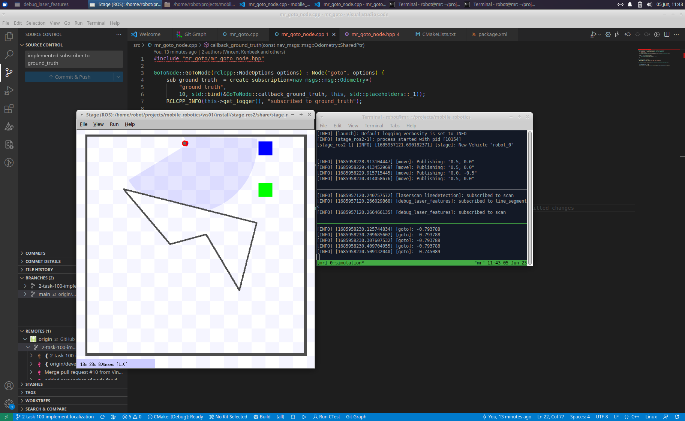

### Set target pose using Rviz
The target pose for our robot is set in Rviz as can be seen from the following screenshot.  
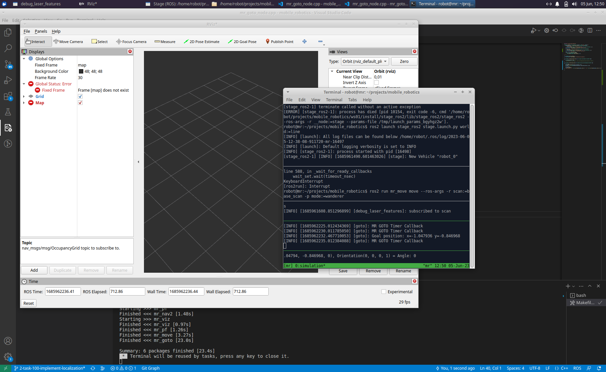

### Driving towards target
After setting the target pose, the robot drives towards the target and stops there as can bee seen from the following sequence of screenshots.  
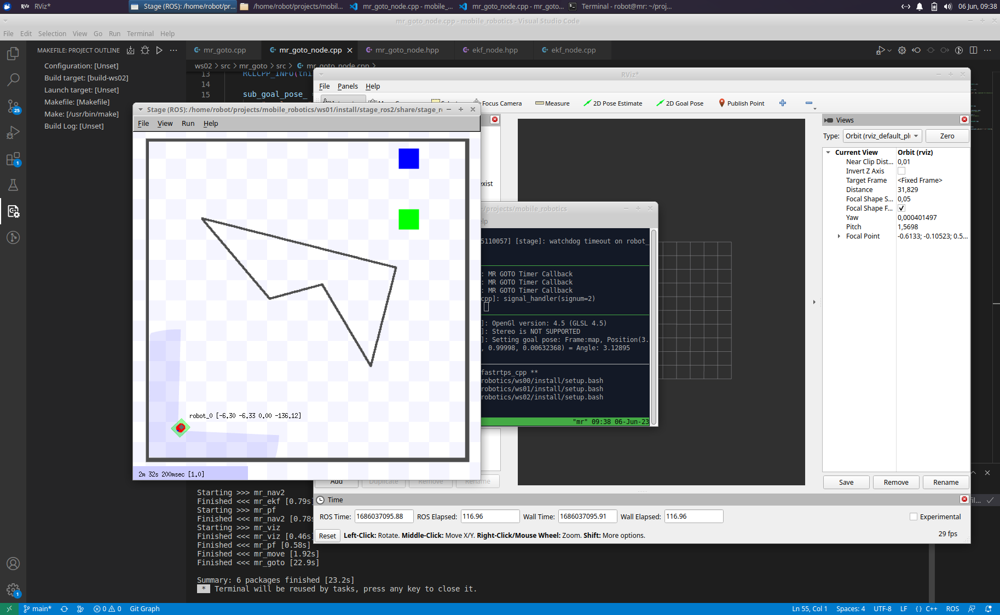
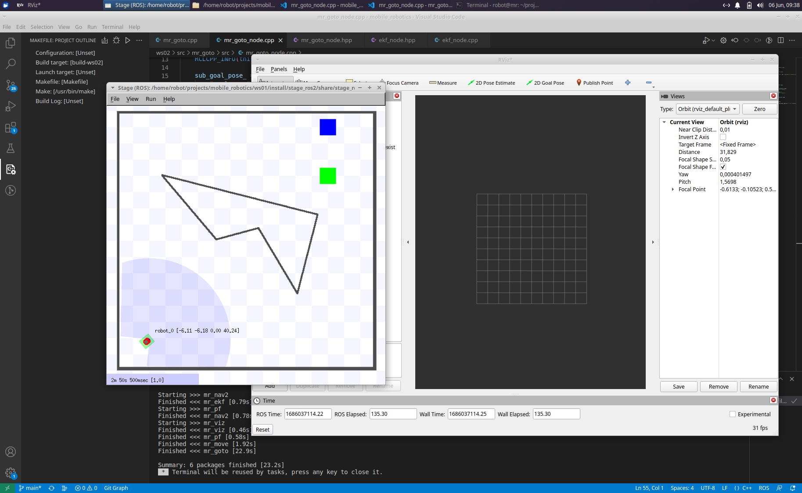
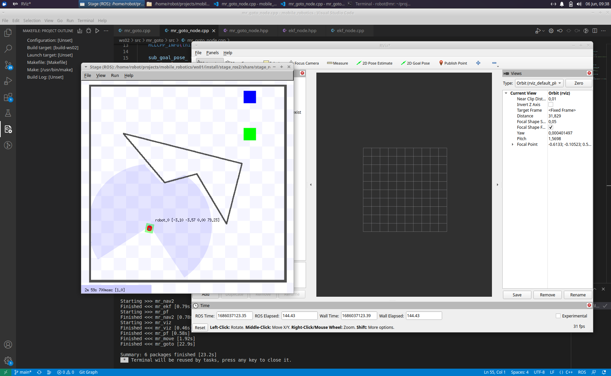

### Turning into correct pose at target
Once the robot has reached the target location it will turn into the right pose as can be seen from the following screenshot.  
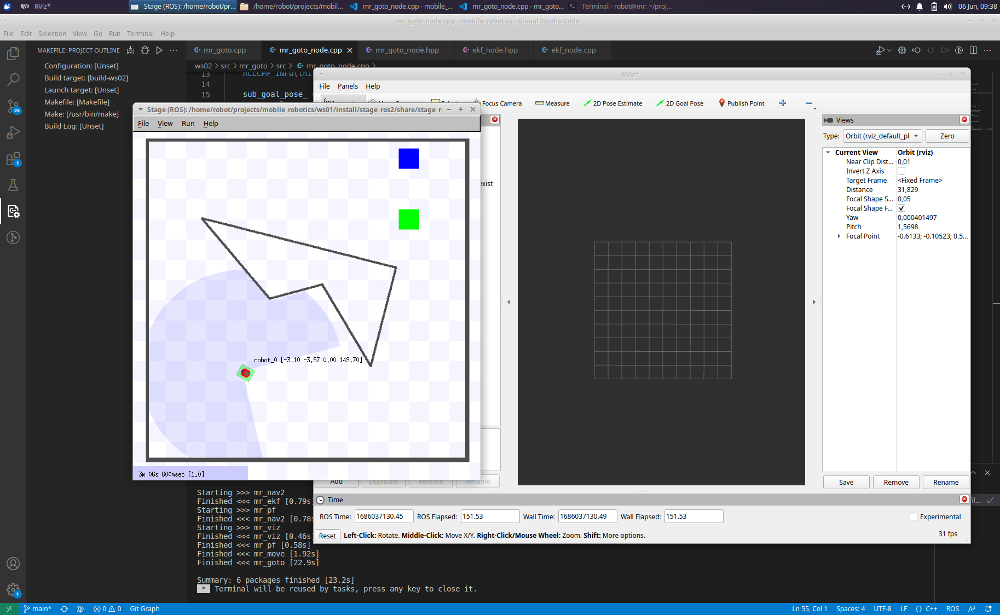

### Avoiding a small obstacle
On the way to the target the robot will avoid small obstacles.
__MISSING_SCREENSHOT__

### Navigating cave obstacle
The following screenshots show that the robot is also capable of navigating cave obstacles.  

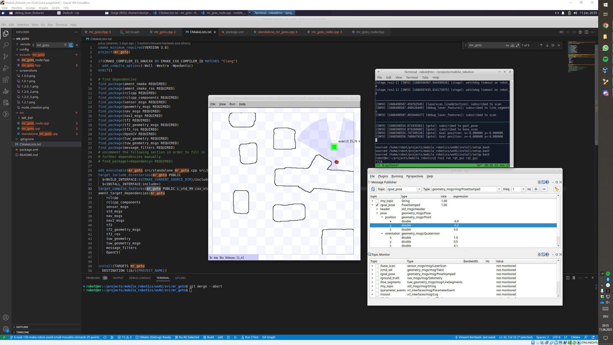 
 
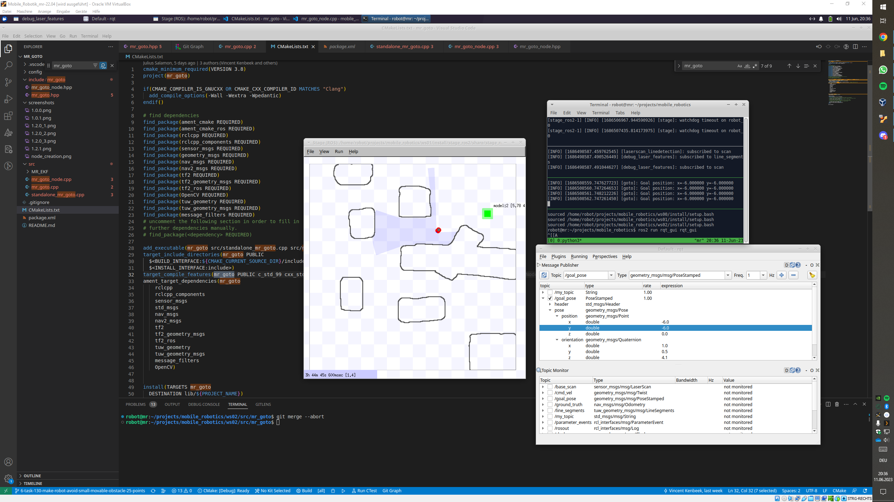 
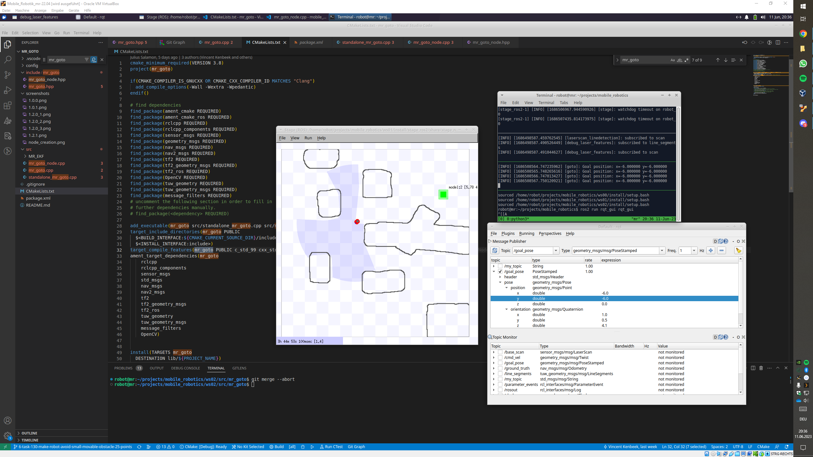 
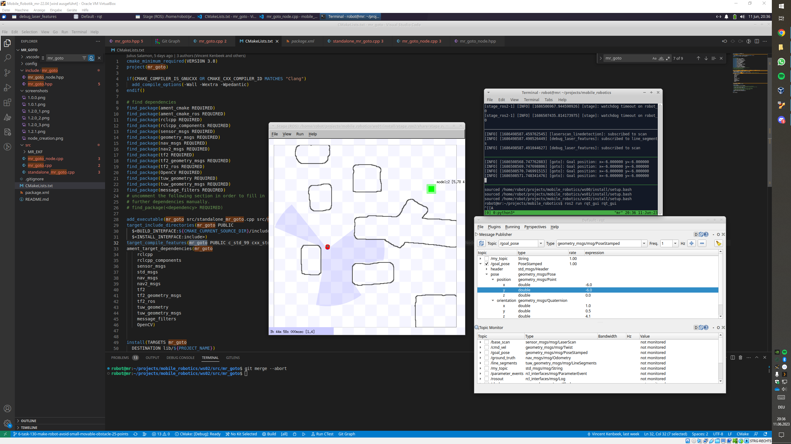 

 
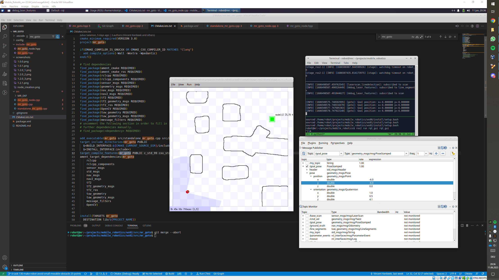 


### Plan waypoints and publish them
The node will once a target pose has been set calculate a path to the target goal through breadth-first search. Once the path has been calculated it will publish the waypoints to ROS nav_msgs/Path. The screenshot below shows the waypoints being published and it also gives a visualization of the proposed path.  
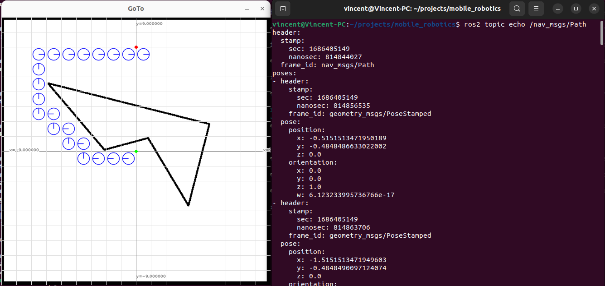

### Publish used map to RViz
__MISSING DOCUMENTATION__

### Basic launch file
__MISSING DOCUMENTATION__

### Initialize self-location and trigger driving using RViz
As shown in the screenshot below, the node listens to /initialpose and /goal so it can be initialized and the driving can be triggered through RViz.
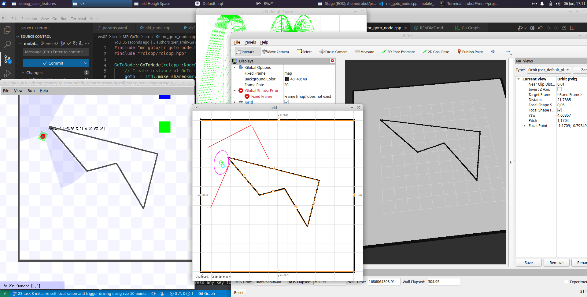

## Points distribution
We believe that with the completed tasks we have managed to get 355 points, in addition, we have also used a branching strategy where completed tasks were first push to devel to be tested, this gives us an additional 20 points for a total of 375 points. We believe that the work balance was ditributed equally and so we want these points to be divided between us evenly.
